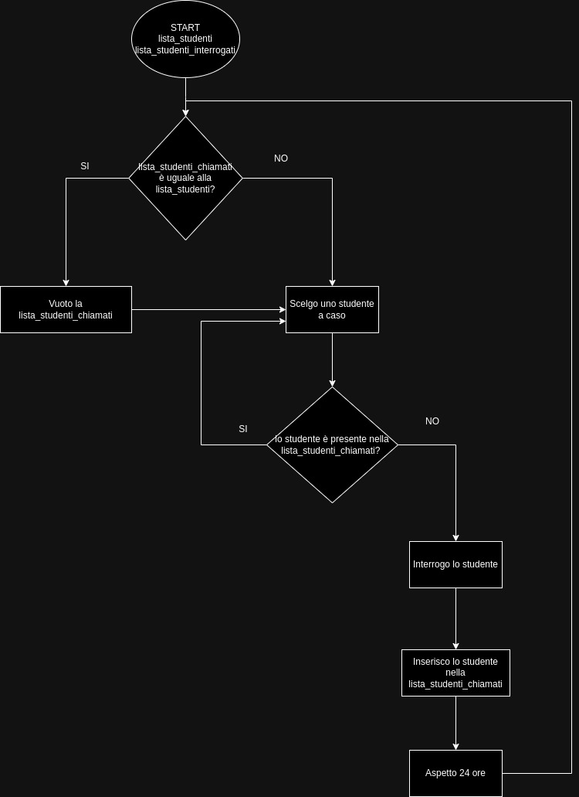

**Tutte le mattine il professore chiama uno studente a caso per un’esercitazione guidata. Una volta chiamati tutti gli studenti ricomincia da capo.**

### Solzuone

**Dato:**
- Lista di studenti: [Davide, Carlo, Serena, Valentina, ...]
- Lista studenti chiamati: [Carlo, Davide, Serena, Valentina ]

**Procedimento**

1. SE la lista di studenti chiamati è uguale alla lista di studenti
    vuotiamo la lista di studenti chiamati

2. Insegnante sceglie uno studente a caso

3. SE (lo studente è presente nella lista studenti chiamati)
    - ripeto il numero 2;
   ALTRIMENTI:
    - lo interrogo;
    - lo inserisco nella lista di studenti chiamati;

4. Aspetto 24 ore e riepto il numero 1;

**Diagramma di flusso**

